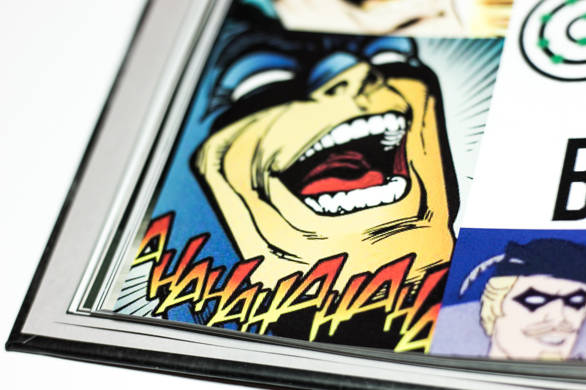
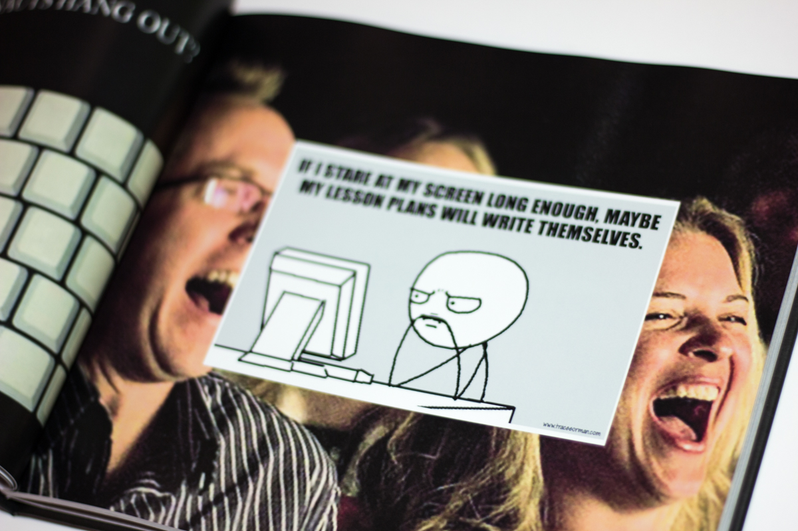
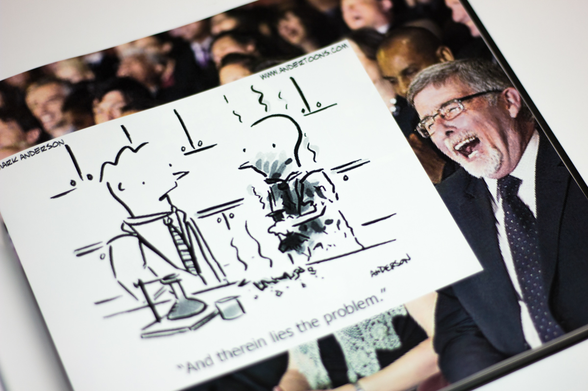
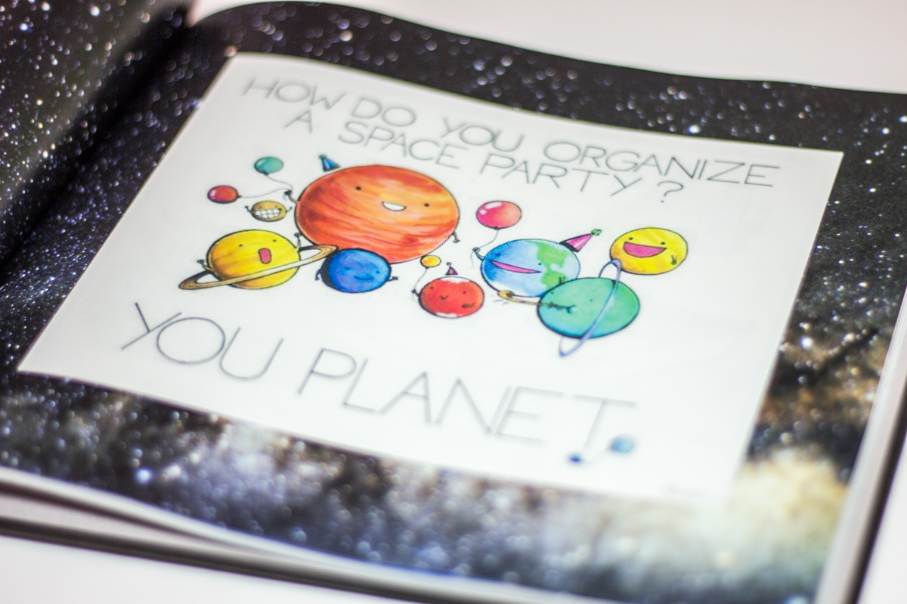
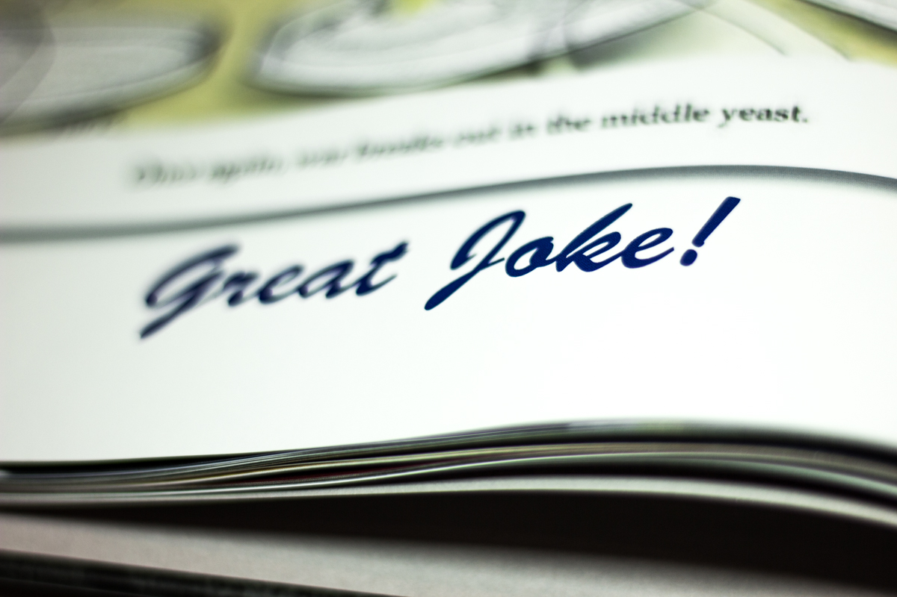
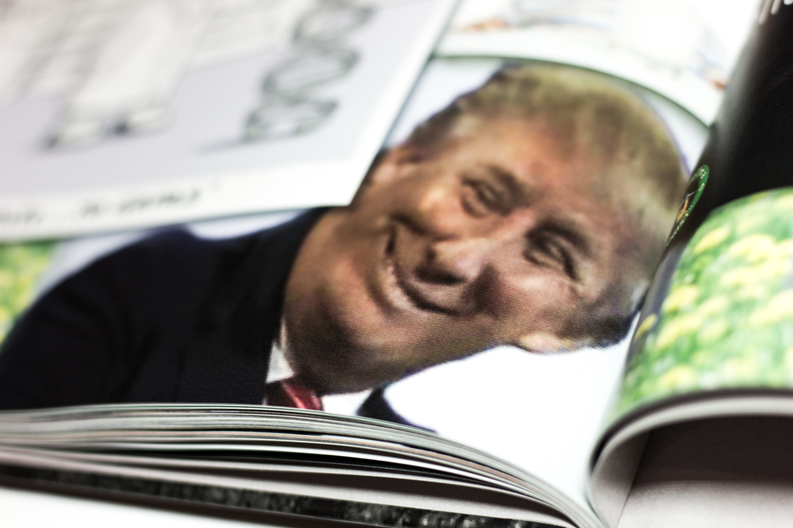
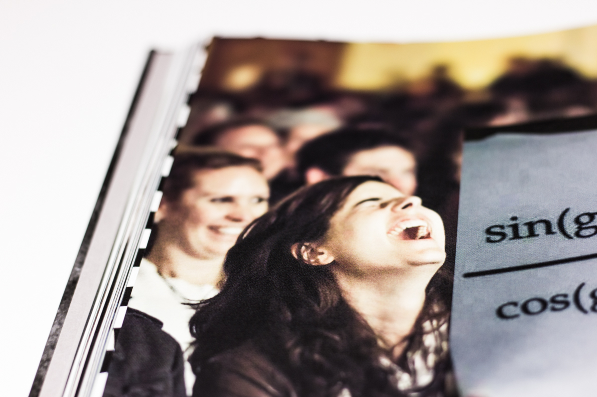
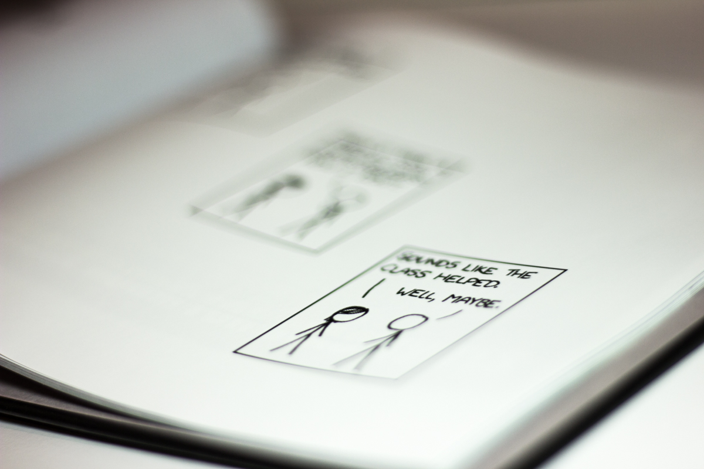

Here is a permanent record of one of the silliest things I've ever done.

On the 3rd of June, 2015, I received an email that would change my life forever.

> Dear Y11 Physics,
>
> I have a great selection of science jokes and thought I might share them with you for your enjoyment. I will email them regularly, and aim to send them with a frequency of 1.57E-06 Hz
>
> If you would like me to take you off the list then please let me know.
>
> Sincerely,
>
> [REDACTED]

The teacher that sent this email was new to the school that year, and taught (at the time) both of the other two physics classes. The first sense we had of him was that, well, he was a bit of a dag—but a proud dag nonetheless. It was admirable, really, the way he owned his silly ties and mad-scientist haircut.

But nothing could prepare us for Joke of the Day.

We should probably get a couple of things out of the way first: The jokes were, fortunately, _not_ daily, and the given frequency of 1.57E-06Hz is 6.6 days, or 0.94 weeks. I never found out what was so significant about that number, but it didn't matter: The emails were irregular enough as it was, ranging from mere hours between instances to months.

The jokes were awful, and often not even science-themed. But they were dad-joke awful. We came to love to hate them, joking around in our classes about the day's most recent joke. They became a part of the furniture. But on the 11th of May, 2016, the very last joke came through, comparing Tesla and Edison to the band AC/DC. I guess nothing lasts forever.

Or does it?

In the middle of exam blocks, people do weird things. Right when we're working the hardest, we have a lot of extra energy to expend on other projects. What others would normally get done in a week, we get done in a few days.

Somewhere in this exam block, I decided that for my friend's birthday, I'd compile all of the jokes into a book. So after checking the prices online and deciding it was feasible, I managed to rush out an entire book in two days. This was my first-ever venture into literature and self-publishing, and I reckon it turned out okay.

This is what it looked like:

This is a small sample of an 88-page book, including a masterfully photoshoppped front cover, which grafted my teacher's face on Einstein, in front of a blackboard. I've had to withhold a few photos to keep identifying imagery out of the project, but I think the photos here give a good snapshot of it.

