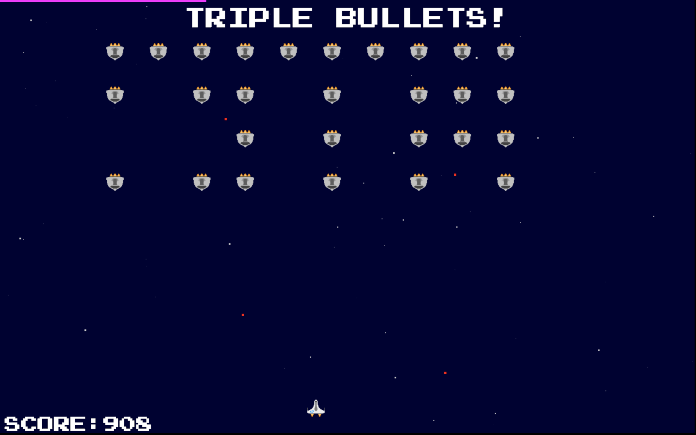

For Year 10 software, when I finally started to take this whole thing seriously, I was up for a challenge. Since the best way to motivate 15-year-olds to learn how to program is to teach them how to make games, my class was tasked with recreating Space Invaders in Visual Basic.

Not using a game engine — using Windows form elements. I said no, and since I matched my stubbornness with competence, poor Mr Howse relented and let me build it in HTML5 Canvas. And the change in frame rate was worth _everything_.

[\#spacerave2014 is the end product](/spacerave2014/). It's an infinite game, and your objective is to score as highly as possible before the alien invasion eventually destroys your ship. In the meantime, you'll experience a wide range of power-ups and power-downs as the timer at the top of the screens ticks through.

I hope you enjoy it.
